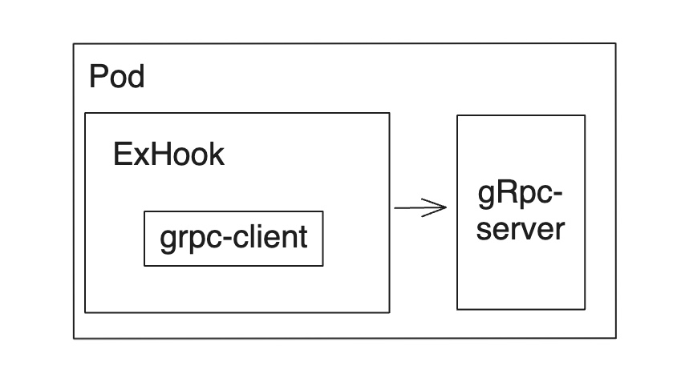

## 背景

在使用emqx作为mqtt时需要我们需要拦截client的各种行为，如连接，发送消息，认证等。除了使用emqx自带的插件机制。我们也可以用多语言-钩子扩展来实现这个功能，但是目前emqx仅仅支持单个grpc服务端的设置，所以会有单点问题。当然也可以用外部的流量代理。本文在k8s环境下使用sidecar的模式对grpc的流量做负载均衡，以实现高可用的效果。如图所示：

进行拦截：

## 打包emqx-exhook-server
`docker build -f Dockerfile -t emqx-exhook-server:0.0.1 .`
## k8s 部署emqx

```
apiVersion: apps/v1
kind: Deployment
metadata:
  name: emqx-deployment
  labels:
    app: emqx
spec:
  replicas: 1
  selector:
    matchLabels:
      app: emqx
  template:
    metadata:
      labels:
        app: emqx
    spec:
      initContainers:
        - name: emqx-exhook-server
          image: emqx-exhook-server:0.0.1
          restartPolicy: Always
      containers:
        - name: emqx
          image: emqx:5.8.0
          ports:
            - name: mqtt
              containerPort: 1883
            - name: mqttssl
              containerPort: 8883
            - name: mgmt
              containerPort: 8081
            - name: ws
              containerPort: 8083
            - name: wss
              containerPort: 8084
            - name: dashboard
              containerPort: 18083
      restartPolicy: Always

---
apiVersion: v1
kind: Service
metadata:
  name: emqx-service
spec:
  selector:
    app: emqx
  ports:
    - name: mqtt
      port: 1883
      protocol: TCP
      targetPort: mqtt
    - name: mqttssl
      port: 8883
      protocol: TCP
      targetPort: mqttssl
    - name: mgmt
      port: 8081
      protocol: TCP
      targetPort: mgmt
    - name: ws
      port: 8083
      protocol: TCP
      targetPort: ws
    - name: wss
      port: 8084
      protocol: TCP
      targetPort: wss
    - name: dashboard
      port: 18083
      protocol: TCP
      targetPort: dashboard
```

### 测试

- mac-desktop下需要开启端口转发

```
kubectl port-forward svc/emqx-service 18083:18083
kubectl port-forward svc/emqx-service 1883:1883 
```

- 配置
  
- 进行发布/订阅
  
  正常连接

### 总结

- 对于在k8s的集群的来说也是支持的，因为每个pod都有一个sidecar
- 对于sidecar 也可以动态升级，不影响主容器
- 因每个pod都有一个sidecar，原生支持负载均衡,且挂掉一台不会影响emqx集群
- [github](https://github.com/ccwxl/emqx-exhook-server)